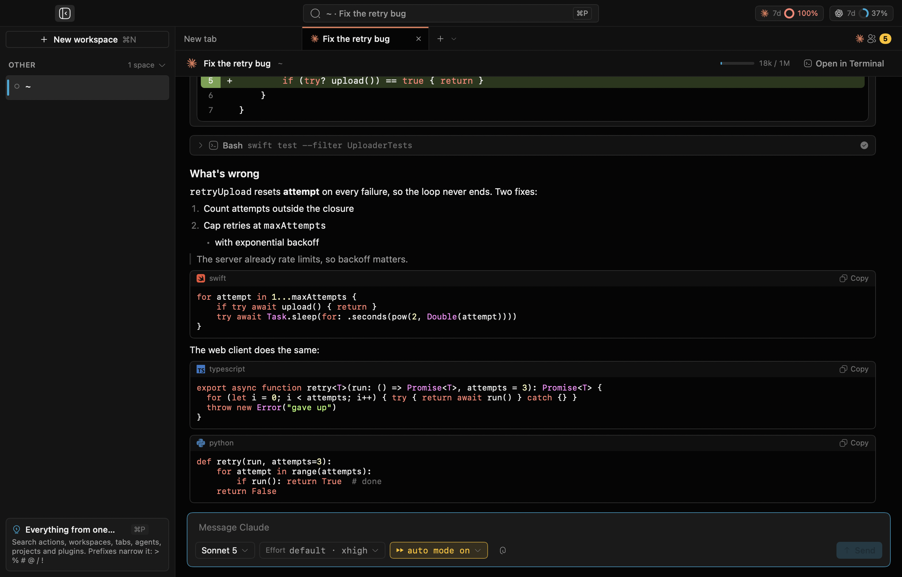
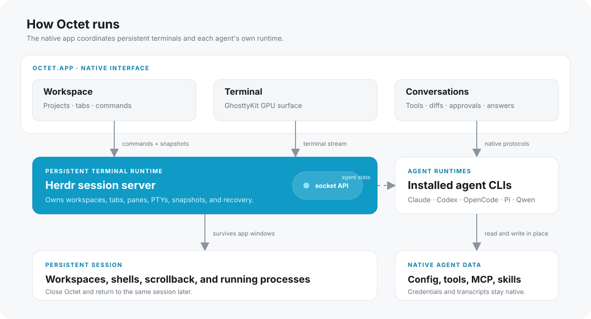

<div align="center">

<h1 align="center">
  <picture>
    <source media="(prefers-color-scheme: dark)" srcset="docs/assets/octet-logo-dark.png">
    <source media="(prefers-color-scheme: light)" srcset="docs/assets/octet-logo-light.png">
    
  </picture>
  &nbsp;Octet
</h1>

### The native macOS terminal built for coding agents

Run agents side by side, see what each one is doing, and move between projects without losing the terminal underneath.

<p>
  <a href="https://github.com/JackTPatterson/octet/releases"><strong>Releases</strong></a>
  ·
  <a href="#build-from-source"><strong>Build from source</strong></a>
  ·
  <a href="docs/PLAN.md"><strong>Architecture</strong></a>
  ·
  <a href="https://github.com/JackTPatterson/octet/issues"><strong>Issues</strong></a>
</p>

<p>
  
  
  
  <a href="LICENSE"></a>
</p>

</div>

---



<p align="center"><em>A real agent process, rendered as a native conversation.</em></p>

Octet is a native terminal and workspace for people who run more than one coding agent. It combines a GPU-rendered terminal with native project navigation, agent-aware tabs, session recovery, a universal marketplace, and an optional conversation view over the real agent process.

It does not proxy prompts through a second service or replace your agent. Claude Code, Codex, OpenCode, and other installed CLIs keep their own configuration, credentials, models, tools, and transcripts. Octet gives them a shared place to work.

**Built on two open-source projects.** Terminal sessions, panes, and agent-state detection come from [Herdr](https://github.com/herdrdev/herdr) (Apache-2.0), which Octet bundles as its session server with one small rendering patch. Terminal rendering comes from [Ghostty](https://github.com/ghostty-org/ghostty) (MIT) through GhosttyKit. Octet is the native macOS layer on top: the sidebar, tabs, Visual Twin, native agent conversations, recovery, palette, and marketplace.

> [!NOTE]
> Octet is pre-1.0. Signed and notarized builds are on the [Releases](https://github.com/JackTPatterson/octet/releases) page as prereleases; expect the feature set to keep moving.

## Why Octet

Agent-heavy work breaks the assumptions of a traditional terminal. A tab title does not tell you who is waiting, completed sessions disappear into scrollback, subagents are easy to miss, and every vendor ships a separate way to manage prompts, skills, and tools.

Octet makes those states part of the interface:

- **Projects stay coherent.** Repositories, worktrees, branches, workspaces, tabs, and panes stay visually grouped.
- **Agent state at a glance.** See which agents are working, blocked, idle, or done without opening every tab.
- **Native conversations, real processes.** The Visual Twin renders an agent transcript as a macOS conversation while input still goes to the actual CLI.
- **Sessions that survive the window.** The bundled session server owns terminals and agents, so workspaces persist across app relaunches.
- **One library for every agent.** Browse and manage MCP servers, plugins, skills, and prompts from a single marketplace.
- **A terminal first.** Splits, scrollback search, themes, shell history, completions, image paste, and keyboard-driven navigation remain first-class.

## Highlights

### Your agents, organized like work

The sidebar groups workspaces by repository and branch. Each running agent gets its own vendor mark, status, context usage, and activity. Tabs automatically follow stable terminal titles, while names you set manually stay untouched.

Agent notices tell you when background work finishes or needs input. Click a notice to jump directly to the relevant pane; work already on screen stays quiet.

### The Visual Twin

Press `⌘⇧V` to switch an agent pane between its terminal and a native transcript view.

The twin reads the structured session files the agent already writes. It renders messages, reasoning, tool calls, command output, diffs, checklists, model information, and context usage without scraping terminal repaints. Answers typed into the twin are sent to the same live process.

When an agent is waiting on a numbered choice or a yes/no decision, Octet can turn that terminal prompt into native actions. If no supported transcript is available, the terminal remains fully usable.

### Command palette

`⌘P` opens one fuzzy-searchable surface for the whole application.

| Prefix | Finds |
| :---: | --- |
| `>` | Actions, including tabs, panes, workspaces, worktrees, and settings |
| `%` | Workspaces with project, branch, and agent state |
| `#` | Tabs across every workspace, including subagent tabs |
| `@` | Running agents and their panes |
| `/` | Projects in common development directories |
| `!` | Session plugins, actions, panes, logs, and installation controls |

Use `↑` / `↓` or `⌃N` / `⌃P` to move, `↩` to run, `⇥` to change filters, and `esc` to close.

### Agent marketplace

Open the Marketplace with `⌘⇧M` to manage integrations across installed agents.

| Library | How Octet handles it |
| --- | --- |
| **MCP servers** | Reads and writes each supported agent's own MCP configuration |
| **Plugins** | Discovers configured marketplaces and calls the agent's native plugin CLI |
| **Skills** | Stores one shared copy and links it into selected agents |
| **Prompts** | Shares reusable prompt files across agent-specific command folders |

Per-agent chips show exactly where an item is installed. When a new MCP server or plugin requires an agent restart, **Reload Agents** resumes eligible conversations in place instead of discarding them.

### A smarter shell prompt

At a bare shell prompt, Octet can provide syntax highlighting, history suggestions, selection, undo/redo, and completions without taking over programs running inside the pane.

Completion sources include:

- executables, shell built-ins, files, and directories;
- command specs, subcommands, options, and descriptions;
- Git branches, package scripts, Make targets, just recipes, and Compose services;
- local shell history ranked by frequency and recency; and
- common command sequences learned from that history.

Anything Octet does not handle is passed through to the shell. Agent TUIs, editors, pagers, and full-screen programs continue to receive their keys normally.

### Recovery that understands agents

Octet journals the agent, session ID, working directory, workspace, and tab for every agent pane it can identify. After a crash, forced shutdown, or session-server restart, it offers to resume interrupted work in the right project.

Recovery uses the agent's native mechanism—such as `claude --resume <id>` or `codex resume <id>`—and can recreate a missing workspace. Sessions can also be recovered later from the command palette.

## Agent support

Octet is designed around capabilities, not a single vendor. It discovers agent homes by convention, reads each tool's native command and prompt folders, and only exposes operations a host supports.

Claude Code, Codex, and OpenCode have deeper transcript/catalog integrations. Other installed agents—including tools following the common `~/.<agent>` layout—can still participate in the shared library, workspace UI, status system, and terminal workflows where their CLI capabilities allow it.

### Subagent tabs

The **Install Subagent Tabs Hook** palette action installs an agent-specific hook that opens spawned work in a named background tab. The hook is inactive outside Octet panes and keeps a `.octet-backup` beside any configuration it changes.

The same operation is available from the bundled CLI:

```sh
/Applications/Octet.app/Contents/MacOS/octet-cli install-subagent-hook claude
```

Reinstall the hook after moving the app because its configuration stores the CLI path.

## Build from source

### Requirements

- macOS 14 or newer on Apple Silicon
- Xcode 26 or 27 with command-line tools
- [XcodeGen](https://github.com/yonaskolb/XcodeGen): `brew install xcodegen`
- [Herdr](https://github.com/herdrdev/herdr): `brew install herdr` (or Rust, to build the patched engine yourself)

Two build inputs are downloaded or built by script rather than committed: `Vendor/GhosttyKit.xcframework` (about 120 MB) and the session-server binary at `Vendor/engine/octet-engine`.

### Build and launch

```sh
git clone https://github.com/JackTPatterson/octet.git
cd octet

# Downloads the prebuilt GhosttyKit.xcframework and verifies its pinned SHA-256.
scripts/fetch-ghosttykit.sh

# Copies the Homebrew Herdr binary into Vendor/engine/octet-engine.
scripts/fetch-engine.sh

xcodegen generate
xcodebuild \
  -project Octet.xcodeproj \
  -scheme Octet \
  -configuration Debug \
  -derivedDataPath build/DerivedData \
  CODE_SIGN_IDENTITY=- DEVELOPMENT_TEAM= \
  build

open build/DerivedData/Build/Products/Debug/Octet.app
```

`CODE_SIGN_IDENTITY=- DEVELOPMENT_TEAM=` signs the build ad hoc, so you don't need the maintainer's Apple team. With your own Apple Development certificate, pass `DEVELOPMENT_TEAM=<your team ID>` instead. Keychain "Always Allow" grants then survive rebuilds, which ad-hoc builds don't.

Stock Homebrew Herdr works. Release builds bundle Herdr with one patch that draws its scrollbar as a capped thumb to match Octet's native scrollbars. To build that engine (needs Rust/cargo), run:

```sh
scripts/build-engine.sh
```

Octet starts an isolated named session, `octet`, with managed configuration at:

```text
~/Library/Application Support/Octet/terminal.toml
```

That session does not modify a standalone Herdr session running elsewhere.

### Run the tests

```sh
xcodebuild \
  -project Octet.xcodeproj \
  -scheme OctetCore \
  -derivedDataPath build/DerivedData \
  CODE_SIGN_IDENTITY=- DEVELOPMENT_TEAM= \
  test
```

The core tests need neither GhosttyKit nor the engine.

## Keyboard map

Octet is designed to stay fast without leaving the keyboard.

| Shortcut | Action | Shortcut | Action |
| --- | --- | --- | --- |
| `⌘P` | Command palette | `⌘⇧P` | Palette with all commands |
| `⌘O` | Open folder | `⌥⌘N` | New window |
| `⌘N` | New workspace | `⌃⌘↑` / `⌃⌘↓` | Previous / next workspace |
| `⌘T` / `⌘W` | New / close tab | `⌘1`…`⌘9` | Select tab (`9` = last) |
| `⌘⇧[` / `⌘⇧]` | Previous / next tab | `⌘B` | Toggle sidebar |
| `⌘D` / `⌘⇧D` | Split right / down | `⌘⇧↩` | Toggle pane zoom |
| `⌘⌥←↑→↓` | Focus pane | `⌘⇧V` | Visual Twin / terminal |
| `⌘⇧A` | Agents board | `⌘⇧M` | Marketplace |
| `⌘F` | Find in scrollback | `⌘G` / `⇧⌘G` | Next / previous result |

The complete, authoritative shortcut list is also available in **Settings → Keyboard**.

## Terminal details

<details>
<summary><strong>Persistent workspaces and native chrome</strong></summary>

The bundled session server owns every pseudo-terminal. Octet subscribes to its socket API for workspace, tab, pane, and agent changes, then renders project navigation and tab management with native SwiftUI/AppKit controls.

Workspaces remain in the named session when the app window closes. Git worktrees are grouped under their main repository, while branches receive their own visual identity in the sidebar.

</details>

<details>
<summary><strong>Themes and terminal colors</strong></summary>

Octet ships dark and light appearances and can follow the colors you already use. **Settings → Appearance → Follow your terminal's colours** reads Ghostty configuration or another `key = value` theme file. Missing values fall back safely, and light terminal backgrounds switch the surrounding chrome as well.

</details>

<details>
<summary><strong>Images and clipboard behavior</strong></summary>

Pasting an image writes it to `~/Library/Application Support/Octet/pasted` and inserts the path, which is what terminal agents can consume safely. Files copied in Finder use their existing paths. Octet retains the latest fifty generated paste files.

Clipboard actions can display a confirmation toast with a preview, including copy-on-select and session copy mode.

</details>

<details>
<summary><strong>Bottom-anchored output</strong></summary>

Terminal content can start at the top of a pane or remain anchored near the bottom while output is short. Bottom anchoring moves the rendered surface instead of changing the grid, avoiding shell reflow and leaving split panes predictable.

</details>

## Architecture



- **Interface:** SwiftUI with AppKit integration for window and terminal behavior.
- **Rendering:** a vendored GhosttyKit framework provides GPU terminal rendering.
- **Persistence:** a bundled Herdr binary owns the named session and exposes its socket API. It also detects agent state.
- **Agent data:** native CLI configuration and structured transcript files remain the source of truth.
- **Local storage:** generated settings, recovery journals, and pasted images live under `~/Library/Application Support/Octet`.

For the original implementation plan and protocol-level notes, see [docs/PLAN.md](docs/PLAN.md). The native-agent UI design is documented in [docs/NATIVE-AGENT-UI.md](docs/NATIVE-AGENT-UI.md).

## Release builds

The release script performs the full distribution pipeline: Release build, Developer ID signing, hardened-runtime validation, notarization, stapling, Gatekeeper assessment, DMG packaging, Sparkle archive signing, and appcast generation.

```sh
scripts/release.sh
```

One-time certificate and `notarytool` credential setup is documented at the top of [`scripts/release.sh`](scripts/release.sh). Sparkle's `generate_keys` must also have created the EdDSA key in the release Mac's Keychain. Versioned DMG and ZIP artifacts are written to `build/release/`; publish both under the tag printed by the script, then commit and push the refreshed `appcast.xml`.

To package an already-built app without running the full release flow:

```sh
scripts/make-dmg.sh /path/to/Octet.app build/Octet.dmg
```

## Debugging

Set `OCTET_SNAPSHOT_DIR` to capture the current app window and terminal text once per second without Screen Recording permission:

```sh
OCTET_SNAPSHOT_DIR=/tmp/octet-snap \
  open -n --env OCTET_SNAPSHOT_DIR=/tmp/octet-snap /path/to/Octet.app
```

This writes `window.png` and `terminal.txt` into the selected directory.

## Project status

The core application, terminal rendering, native sidebar and tabs, agent state, subagent hooks, recovery, marketplace, slash menu, Visual Twin, command palette, and distribution pipeline are implemented. The repository remains pre-1.0; see [TODO.md](TODO.md) for the current terminal audit and [docs/PLAN.md](docs/PLAN.md) for design history and verification notes.

## Contributing

Issues and pull requests are welcome. For code changes:

1. Generate the Xcode project with `xcodegen generate`.
2. Keep reusable, UI-independent logic in `Shared/` where practical.
3. Add or update tests in `OctetTests/`.
4. Run the `OctetCore` test scheme before opening a pull request.
5. Keep vendor binaries and generated build output out of commits.

## License

Octet is available under the [MIT License](LICENSE).

Third-party attributions are collected in [`Octet/Resources/ThirdPartyNotices.txt`](Octet/Resources/ThirdPartyNotices.txt) and bundled into release builds.

---

<div align="center">

**Built for many agents, without becoming another agent.**

</div>
