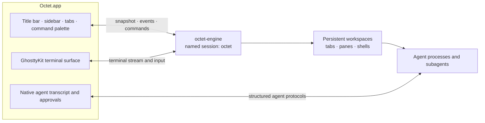

# Octet: a native macOS terminal for agents

Octet is a native macOS terminal. Its session server owns every terminal and
agent; Octet embeds a GPU terminal engine to render the session client and
replaces the server's text sidebar and tab row with native chrome driven by
the server's socket API.

## Architecture

- **Session:** Octet runs its own named session (`octet`) so a standalone
  session in another terminal is untouched. The session server ships inside
  Octet.app as `Contents/MacOS/octet-engine`.
- **State:** a store subscribes to session events and re-fetches
  `session.snapshot` (debounced) on any change.
- **Projects:** workspaces are grouped by git repository root (worktrees join
  their main repo) of the workspace's cwd.
- **Agents:** the server's agent records (`agent`, state `working|blocked|idle|done`)
  drive a status glyph and a soft per-agent hue (tab colors at 15%).
- **Subagents:** a Claude Code `PreToolUse` hook (`octet-cli hook claude`) opens
  a tab named after the subagent in the same workspace, running
  `octet-cli agent-watch` (live transcript view) and reporting working/done to
  the session server so the tab shows real state.

## v1 scope (definition of done)

1. App builds with xcodegen + xcodebuild; launches a window.
2. The terminal engine renders the session client; keyboard, IME text, mouse,
   scroll, resize, focus, and clipboard work.
3. Native sidebar: projects → workspaces, focused highlight, agent state glyph
   and hue, click focuses the workspace; live updates.
4. Native top tab bar for the focused workspace's tabs; click focuses, `+`
   creates, close button closes; subagent tabs show their names and state.
5. Dark styling: #050505 terminal, #171717 chrome, 1px #262626 borders,
   4pt radii, 248pt sidebar, accent #19AAD8, uppercase group headers.
6. Shortcuts: ⌘T new tab, ⌘W close tab, ⌘1–9 tab, ⌃⌘↑/↓ workspace,
   ⌘B toggle sidebar, ⌘N new workspace.
7. Subagent tabs: hook installer + agent-watch viewer, verified end to end.
8. Unit tests for socket parsing, project grouping, agent hues, transcript
   rendering.

Out of v1: command palette/search, settings UI, multiple windows, SSH machines,
packaging/signing/notarization.

## v1 status (2026-09-17)

All eight items done and verified in the running app:

| Item | Evidence |
| --- | --- |
| Build | xcodegen + xcodebuild succeed |
| Terminal | the session renders; typing, ⌘-shortcuts, click-to-focus, wheel scroll verified by synthetic events; resize, copy/paste, title, exit verified in the terminal spike |
| Sidebar | projects grouped (OTHER / two repos), branches, Claude hue + state; card click switches workspace |
| Tab bar | tab click switches; ⌘T creates, ⌘W closes; subagent tab shows name, state, Claude mark |
| Styling | theme colors and vertical tab metrics applied |
| Shortcuts | ⌘1–9, ⌘T/W/N/B, ⌃⌘↑/↓ verified |
| Subagent tabs | real `claude -p` run spawned a subagent → background tab "Answer arithmetic" rendered its prompt and answer, state done |
| Tests | 51 unit tests pass |
| Session recovery | killed a session server holding two agents, relaunched: the panel offered both, and the server accepted the resume tabs it builds |
| Marketplace | real MCP servers from both CLIs merged per agent; 34 library skills listed with per-agent chips; prompts created, listed and linked |
| Slash menu | renders over the terminal with built-ins, user, project and plugin commands; `/mcp` submenu lists the machine's real servers |
| Confirmations | Octet's own dialog replaces every NSAlert (verified on the quit confirmation) |
| Agent-agnostic | hosts discovered by convention from `~/.<agent>`; hook installer, library, slash commands and MCP/plugin CLIs all keyed off host capabilities |
| Performance | Release build idles at ~1% CPU (debug window snapshots were 63% of main-thread time) |

Not verified: IME composition, mixed-DPI displays, and ⌘⇧[ / ⌘⇧].
The session server's own tab row is clipped rather than disabled (the server
has no option to hide it with multiple tabs).
